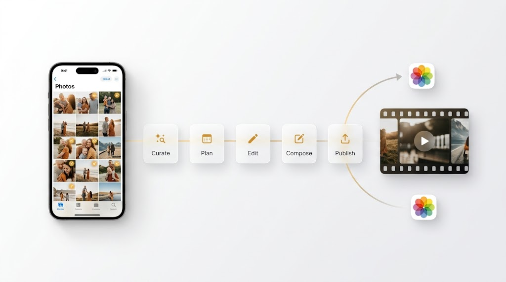

# photo-montage

**Turn your own Apple Photos into a cinematic, professionally-edited memory reel — with Gemini as the editor — then publish it back to Photos. macOS · local-first · no public uploads.**

`photo-montage` is an **Agent Skill** — the open `SKILL.md` standard — so it works with any skill-aware agent, including **[Claude Code](https://docs.anthropic.com/en/docs/claude-code)** and **[Google Antigravity](https://antigravity.google/docs/skills)**. You describe the reel in plain language — *"make a reel from my 4th of July weekend"* — and the agent drives a mostly-local pipeline: it finds your best shots, uses **Gemini** to trim videos to their strongest moments and direct the edit, scores it with AI or your own music, and renders a vertical, social-ready cut for YouTube Shorts / Reels / TikTok.

**Where your media goes:** selection, culling, rendering, and the publish-back all run **locally on your Mac**. The AI steps (clip-trimming, the director, the self-review) send **downscaled proxies, thumbnails, and sampled frames** to Google **Gemini** — via your Gemini API key, or your own Google Cloud **Vertex** project if you'd rather keep processing in your own tenancy. Full-res originals and the finished render stay local, and nothing is ever posted publicly — the only "publish" is back into *your own* Photos library.



## What makes it good

- **Gemini clips your videos to the best moment** — no more 40-second raw clips; it finds the laugh, the jump, the reveal.
- **Gemini directs the edit** — reviews every candidate, picks and orders the shots, chooses the ideal length the material earns (it won't pad).
- **Chronological by EXIF** — a true multi-day story arc (the next morning lands after last night).
- **Cinematic finish** — color grade + vignette, smooth continuous motion on stills, cross-dissolves, fades, loudness-normalized audio.
- **AI or your own music, cut to the hook** — Google **Lyria** (copyright-clean), or a track from your own library that it auto-trims to the **chorus/hook** so the recognizable part lands on the reel, not a slow intro.
- **AI cover card, matched to your trip** — a title card (Nano Banana), full-frame 9:16, generated *last* and styled to the real setting the director saw in your photos (mountains, beach, city…), not a generic template. It's also the reel's **opening frame**, so your social thumbnail is the cover — never a black fade-in.
- **Auto self-review** — a Gemini critic flags oddball/duplicate/blurry shots and pacing problems *before* you watch it.
- **Local-first, no public uploads** — read-only on your library; editing/rendering happen on your Mac; only downscaled proxies/thumbnails go to Gemini for the AI steps (your key, or your own Vertex project).

## How it works

```
preflight → select (your library) → clip videos (Gemini) → consolidate
→ director/storyboard (Gemini) → music → EXIF order → cover → build (cinematic)
→ self-review → publish back to Photos
```

Each step is a small, self-contained `uv run` script in `scripts/`; the agent orchestrates them and checks the storyboard with you before rendering. See [`SKILL.md`](SKILL.md) for the full agent instructions.

## Requirements

- **macOS** with the Apple Photos app
- [`uv`](https://docs.astral.sh/uv/) · `ffmpeg` (`brew install ffmpeg`) · `sips` (built-in)
- Terminal **Full Disk Access** (read the library) and, to publish, **Automation → Photos**
- An AI backend (either one):
  - **Vertex AI** via `gcloud auth application-default login` — *recommended for personal media* (your data isn't used for training; see [Privacy](#privacy)), **or**
  - a **Gemini API key** (`GEMINI_API_KEY`, from [aistudio.google.com/apikey](https://aistudio.google.com/apikey)) — use a **paid** key for private handling; the free tier may be used to train Google's models.

## Install

Clone into your agent's skills directory:

```bash
# Claude Code
git clone https://github.com/n0012/photo-montage.git ~/.claude/skills/photo-montage

# Google Antigravity — global (all workspaces)
git clone https://github.com/n0012/photo-montage.git ~/.gemini/config/skills/photo-montage
# …or per-workspace: <workspace-root>/.agents/skills/photo-montage
```

Any other Agent-Skills-compatible agent works too — drop the folder in its skills directory. The agent discovers the skill from `SKILL.md`'s `description`, then follows it; the `scripts/` all support `--help` so the agent can use them as black boxes.

Then configure (all optional — see [`.env.example`](.env.example)):

```bash
export GEMINI_API_KEY=...              # or use gcloud ADC
export PHOTO_MONTAGE_MUSIC_DIR=~/Music # a folder of DRM-free tracks (optional)
export PHOTO_MONTAGE_ALBUM="Montages"  # default publish album (optional)
```

## Use

Ask your agent, e.g.:

> "Make a 60–90s cinematic reel from my Lake Tahoe trip and put it in Photos."

The agent proposes a **storyboard** for your sign-off, then renders and publishes.

You can also run steps directly:

```bash
uv run scripts/preflight.py --pool 60
uv run scripts/select_photos.py --output-dir projects/tahoe --from-date 2026-08-01 --to-date 2026-08-05 --download-missing
# … clip → consolidate → plan_edit → build_reel → publish_photos
```

## Examples

- [`examples/run-via-agy.sh`](examples/run-via-agy.sh) — one command to drive the whole skill **headlessly via the Antigravity CLI (`agy`)**: `./run-via-agy.sh` (or pass your own request). Streams a log, saves the mp4, opens it when done. It shows the two touches that make a reel feel produced: a **cover the agent styles from your actual photos**, and **your own soundtrack** — set `MONTAGE_MUSIC=/path/to/track.mp3` to score with your track instead of AI-generated Lyria.

  ```bash
  ./examples/run-via-agy.sh                                   # last 7 days, Lyria score
  MONTAGE_MUSIC=~/Music/song.mp3 ./examples/run-via-agy.sh    # your own track
  ./examples/run-via-agy.sh "Make a reel from my camping trip"  # your own request
  ```

  The skill itself is **agent-agnostic** — the same `SKILL.md` runs under Claude Code or any Agent-Skills-compatible agent. This example just shows the headless/CLI path; here it happens to use Antigravity's `agy`, but nothing about the skill is tied to it.

## Inspiration & credits

This project stands on two shoulders:

- **[Co-Director](https://co-director-agent.github.io/)** — a Google research project on *agentic generative video storytelling*, where a multi-agent system works like a film crew with a built-in auditor that catches inconsistencies **before** rendering (I was part of the Co-Director team). `photo-montage` brings that ethos — an agent that *directs* rather than *concatenates*, and reviews its own cut — down to everyday life: your Apple Photos, on your Mac.
- **[OpenMontage](https://github.com/calesthio/OpenMontage)** — an open-source, agentic video-production system. Several patterns here were inspired by it: the director + **self-review** pass, a **slideshow-risk** score, and single-**workspace consolidation** so no candidate gets stranded.

Built on Google **Gemini / Lyria / Nano Banana** (via the Gemini API or Vertex AI), [osxphotos](https://github.com/RhetTbull/osxphotos), and **FFmpeg**.

## Privacy

Local-first, not fully offline. Your library is read **read-only**; selection, rendering, and the publish-back happen **on your Mac**, and nothing is ever posted publicly (the only "publish" is into your own Photos library). The AI steps do send data to Google: **downscaled video proxies, still thumbnails, and sampled frames** go to **Gemini** for clipping, directing, and self-review. Full-res originals and the final render stay local, and your real photos are never generatively altered.

**How that data is handled depends on the channel you choose** (per Google's terms — verify current versions):

| Channel | Used to train Google's models? | Notes |
|---|---|---|
| **Vertex AI** (your own GCP project) | **No** | Enterprise data governance; stays in your project; zero-data-retention option. **Recommended for personal photos.** |
| **Gemini API — paid** | **No** | Not human-reviewed for improvement; retention for safety/legal only. |
| **Gemini API — free tier** | **Yes** | Content may be used to improve Google products and **human-reviewed** (de-identified). **Avoid for personal media.** |

For the most private setup, use **Vertex AI** (`gcloud auth application-default login`) or a **paid** Gemini API key.

## License

[MIT](LICENSE)
